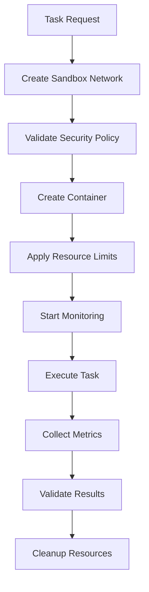

<<<<<<< HEAD
# Architecture Documentation

## System Architecture Overview

Claude's Claude is designed as a dual-agent collaborative development environment with a sophisticated architecture that enables intelligent, traceable, and safe code generation.

### Core Principles

1. **Separation of Concerns**: Director handles high-level planning and validation, Executor handles implementation
2. **Shared Context**: Agents maintain a synchronized memory of project state and decisions
3. **Version Control Integration**: Git operations are core to the workflow
4. **Decision Transparency**: All major decisions are logged and auditable

## Detailed Architecture Components

### 1. User Interface Layer

#### Dual-Panel Layout
```typescript
interface ClaudePanelProps {
  id: string;                  // 'primary' or 'secondary'
  title: string;              // Display title
  role: 'director' | 'executor';
  onDecisionRequest: (decision: Decision) => void;
  onProceedCheck: (context: ProceedContext) => void;
  sharedContext: SharedMemory;
  messages: AgentMessage[];
}
```

#### Decision Interface Components
```typescript
interface DecisionModal {
  isVisible: boolean;
  decision: Decision;
  onApprove: (type: 'yes' | 'always_yes') => void;
  onReject: (reason: string) => void;
  renderDiffPreview: (changes: FileChange[]) => JSX.Element;
  renderHistory: (pastDecisions: Decision[]) => JSX.Element;
}
```

### 2. Shared Memory System

#### Data Structures
```typescript
interface SharedMemory {
  // Current project context
  context: ProjectContext;

  // Decision history
  decisions: DecisionHistory;

  // State management
  state: MemoryState;

  // Artifact tracking
  artifacts: ArtifactRegistry;

  // Performance metrics
  metrics: PerformanceMetrics;
}

interface ProjectContext {
  projectName: string;
  repositoryUrl?: string;
  mainBranch: string;
  currentTask?: string;
  constraints: Constraint[];
  goals: Goal[];
  timeline: ProjectTimeline;
}

interface DecisionHistory {
  active: Decision[];
  archived: Decision[];
  patterns: DecisionPattern[];
  conflicts: ConflictRecord[];
}
```

#### Memory Synchronization
```typescript
class MemorySynchronizer {
  async syncToRedis(): Promise<void> {
    // Persist shared memory to Redis
  }

  async loadFromRedis(): Promise<void> {
    // Load shared memory from Redis
  }

  async createCheckpoint(): Promise<string> {
    // Create memory checkpoint for rollback
  }

  async restoreCheckpoint(checkpointId: string): Promise<void> {
    // Restore memory to previous state
  }
}
```

### 3. Agent Communication Framework

#### Message Types and Protocols
```typescript
enum MessageType {
  // Primary → Secondary
  DIRECTION = 'direction',
  FEEDBACK = 'feedback',
  INTERRUPTION = 'interruption',

  // Secondary → Primary
  PROCEED_CHECK = 'proceed_check',
  VALIDATION = 'validation',
  STATUS_UPDATE = 'status_update',

  // Bidirectional
  COLLABORATION = 'collaboration',
  CONFLICT_RESOLUTION = 'conflict_resolution'
}

interface AgentMessage {
  id: string;
  type: MessageType;
  sender: AgentType;
  receiver?: AgentType;
  content: string;
  priority: MessagePriority;
  requiresResponse: boolean;
  responseDeadline?: Date;
  attachments: MessageAttachment[];
  metadata: Record<string, any>;
  timestamp: Date;
  sequence: number;
}
```

#### Communication Channel
```typescript
class CommunicationChannel {
  private subscribers: Map<MessageType, MessageHandler[]>;

  async subscribe(
    messageType: MessageType,
    handler: MessageHandler
  ): Promise<SubscriptionToken> {
    // Subscribe to specific message types
  }

  async publish(message: AgentMessage): Promise<void> {
    // Publish message to subscribers
    // Handle priority and deadlines
  }

  async requestResponse(
    message: AgentMessage,
    timeout: number = 30000
  ): Promise<AgentMessage> {
    // Request synchronous response with timeout
  }
}
```

### 4. Git Integration Layer

#### Enhanced Git Manager
```typescript
class EnhancedGitManager {
  private branches: Map<string, GitBranch>;
  private checkpoints: Map<string, GitCheckpoint>;
  private agentMetadata: AgentMetadataManager;

  async createIsolatedTaskBranch(
    task: Task,
    agent: AgentType
  ): Promise<GitBranch> {
    // Create branch with agent-specific naming
    // Set up branch protection
    // Initialize tracking
  }

  async commitWithMetadata(
    agent: AgentType,
    message: string,
    files: string[],
    metadata: CommitMetadata
  ): Promise<GitCommit> {
    // Create commit with agent context
    // Update shared memory
    // Create checkpoint if needed
  }

  async createDecisionCheckpoint(
    decision: Decision
  ): Promise<GitCheckpoint> {
    // Tag current state with decision metadata
    // Store decision details
    // Enable rollback to this point
  }

  async rollbackToCheckpoint(
    checkpoint: GitCheckpoint,
    reason: string
  ): Promise<RollbackResult> {
    // Perform git rollback
    // Update shared memory
    // Log rollback decision
  }
}
```

#### Branch Management Strategy
```yaml
branch_strategy:
  main_branch: main
  development_branches:
    - type: feature
      pattern: "feature/*"
      protection: true
    - type: task
      pattern: "task/*"
      isolation: full
      auto_cleanup: true
  agent_branches:
    director: "director/*"
    executor: "executor/*"
  cleanup_policy:
    max_age: "7d"
    success_criteria: "merged"
    manual_review: false
```

### 5. Decision Engine

#### Decision Types
```typescript
enum DecisionType {
  PROCEED_CHECK = 'proceed_check',      // Executor asks permission
  PLAN_APPROVAL = 'plan_approval',      // Director reviews plan
  CONFLICT_RESOLUTION = 'conflict',     // Agents disagree
  ROLLBACK_REQUEST = 'rollback',        // Undo previous decision
  ABORT_REQUEST = 'abort'              // Stop current task
}

interface Decision {
  id: string;
  type: DecisionType;
  initiator: AgentType;
  timestamp: Date;
  status: DecisionStatus;
  context: DecisionContext;
  options: DecisionOption[];
  outcome?: DecisionOutcome;
  reasoning?: string;
  attachments: DecisionAttachment[];
}
```

#### Decision Workflow
```typescript
class DecisionEngine {
  async processProceedCheck(
    check: ProceedCheck
  ): Promise<Decision> {
    // Validate context
    // Create decision record
    // Present to Director
    // Wait for response
    // Execute approved action
    // Log outcome
  }

  async createAlwaysYesRule(
    pattern: DecisionPattern
  ): Promise<AlwaysYesRule> {
    // Create automated approval rule
    // Store pattern for matching
    // Enable auto-approval for similar decisions
  }

  async getDecisionHistory(
    filters: DecisionFilter
  ): Promise<Decision[]> {
    // Query decision history
    // Apply filters
    // Return ordered results
  }
}
```

### 6. Workflow Orchestration

#### Task Execution Pipeline
```typescript
class WorkflowOrchestrator {
  private state: WorkflowState;
  private eventEmitter: WorkflowEventEmitter;

  async executeTask(task: Task): Promise<ExecutionResult> {
    try {
      // Initialize workflow
      await this.initializeWorkflow(task);

      // Director creates plan
      const plan = await this.director.createPlan(task);
      await this.sharedMemory.setPlan(plan);

      // Executor implements in phases
      for (const phase of plan.phases) {
        const result = await this.executor.executePhase(phase);

        // Check for approval
        const approval = await this.decisionEngine.checkProceed({
          phase,
          result,
          context: this.sharedMemory.getContext()
        });

        if (!approval.approved) {
          await this.rollbackToLastCheckpoint();
          break;
        }

        // Continue to next phase
      }

      return { success: true, artifacts: this.sharedMemory.getArtifacts() };
    } catch (error) {
      await this.handleWorkflowError(error);
      throw error;
    }
  }
}
```

#### State Management
```typescript
enum WorkflowState {
  INITIALIZING = 'initializing',
  PLANNING = 'planning',
  EXECUTING = 'executing',
  PAUSED = 'paused',
  COMPLETED = 'completed',
  ROLLED_BACK = 'rolled_back',
  ERROR = 'error'
}

interface WorkflowEvent {
  type: WorkflowEventType;
  timestamp: Date;
  payload: any;
  source: AgentType;
}
```

### 7. Performance and Monitoring

#### Metrics Collection
```typescript
interface PerformanceMetrics {
  agentMetrics: AgentPerformance[];
  decisionMetrics: DecisionMetrics[];
  gitMetrics: GitMetrics[];
  memoryMetrics: MemoryMetrics[];

  // Real-time monitoring
  currentLoad: SystemLoad;
  responseTimes: ResponseTimeHistory;
  errorRates: ErrorRateHistory;
}

class MetricsCollector {
  async trackDecision(decision: Decision): Promise<void> {
    // Track decision performance
  }

  async trackAgentPerformance(
    agent: AgentType,
    metrics: AgentPerformance
  ): Promise<void> {
    // Track agent-specific metrics
  }

  async generateReport(period: ReportPeriod): Promise<PerformanceReport> {
    // Generate comprehensive performance report
  }
}
```

#### Monitoring Dashboard
```typescript
interface MonitoringDashboard {
  // Real-time metrics
  systemHealth: SystemHealth;
  agentStatus: AgentStatus[];
  activeDecisions: Decision[];
  recentActivity: ActivityLog[];

  // Analytics
  performanceTrends: TrendAnalysis;
  decisionPatterns: PatternAnalysis;
  efficiencyMetrics: EfficiencyReport;
}
```

### 8. Extensibility Framework

#### Plugin System
```typescript
interface ClaudePlugin {
  name: string;
  version: string;
  dependencies?: string[];

  // Lifecycle hooks
  onInit?: (context: PluginContext) => Promise<void>;
  onDecision?: (decision: Decision) => Promise<PluginResult>;
  onCommit?: (commit: GitCommit) => Promise<void>;
  onError?: (error: AgentError) => Promise<void>;

  // Custom components
  customComponents?: Map<string, React.Component>;
  customCommands?: Map<string, CommandHandler>;
}

class PluginManager {
  async loadPlugin(plugin: ClaudePlugin): Promise<void> {
    // Load and validate plugin
    // Register hooks and components
  }

  async executeHook(
    hookName: keyof ClaudePlugin,
    context: any
  ): Promise<PluginResult[]> {
    // Execute plugin hooks
    // Collect and merge results
  }
}
```

#### Configuration System
```typescript
interface SystemConfig {
  // Agent configuration
  agents: AgentConfig;

  // Git configuration
  git: GitConfig;

  // Memory configuration
  memory: MemoryConfig;

  // UI configuration
  ui: UIConfig;

  // Plugin configuration
  plugins: PluginConfig;

  // Security configuration
  security: SecurityConfig;
}

class ConfigManager {
  async loadConfiguration(): Promise<SystemConfig> {
    // Load from multiple sources
    // Apply environment overrides
    // Validate configuration
  }

  async updateConfiguration(updates: Partial<SystemConfig>): Promise<void> {
    // Update configuration
    // Validate changes
    // Notify affected components
  }
}
```

## Design Patterns and Principles

### 1. Observer Pattern
- Used for message broadcasting
- Agents subscribe to specific event types
- Decoupled communication between components

### 2. Strategy Pattern
- Different decision strategies based on context
- Configurable git branching strategies
- Pluggable memory storage backends

### 3. State Pattern
- Workflow state management
- Agent state transitions
- Decision state tracking

### 4. Command Pattern
- Git operations as commands
- Agent actions as commands
- Undo/redo functionality

### 5. Factory Pattern
- Agent instantiation
- Plugin creation
- Decision factory methods

## Scalability Considerations

### Horizontal Scaling
- Multiple instances of each agent type
- Load balancing for decision requests
- Distributed memory cache

### Vertical Scaling
- Optimized memory usage
- Efficient git operations
- Streamlined communication protocols

### Data Partitioning
- Sharded decision history
- Branch-specific isolation
- Time-based data archiving

## Error Handling and Resilience

### Error Types
```typescript
enum ErrorType {
  AGENT_ERROR = 'agent_error',
  COMMUNICATION_ERROR = 'communication_error',
  GIT_ERROR = 'git_error',
  MEMORY_ERROR = 'memory_error',
  VALIDATION_ERROR = 'validation_error',
  SYSTEM_ERROR = 'system_error'
}

interface ErrorContext {
  type: ErrorType;
  message: string;
  stack?: string;
  timestamp: Date;
  agent?: AgentType;
  decisionId?: string;
  retryable: boolean;
}
```

### Recovery Strategies
1. **Automatic Retry**: For transient network errors
2. **Fallback Mode**: When primary memory store unavailable
3. **Checkpoint Recovery**: Roll to last known good state
4. **Manual Intervention**: For critical system errors

## Future Enhancements

### 1. Multi-Agent Scaling
- Support for more than two agents
- Specialized agent roles (Tester, Documenter, etc.)
- Agent coordination protocols

### 2. External Integration
- CI/CD pipeline integration
- Testing framework integration
- Documentation generation
- Performance monitoring tools

### 3. Advanced Analytics
- Code quality metrics
- Development pattern analysis
- Predictive decision making
- Automated optimization suggestions

### 4. Machine Learning Integration
- Decision pattern recognition
- Agent performance optimization
- Automated task decomposition
- Predictive error prevention

This architecture provides a solid foundation for building an intelligent, collaborative development environment that scales with project complexity while maintaining traceability and safety.
=======
# Claude's Claude - Architecture Documentation

## Overview

Claude's Claude is a multi-agent orchestration system that transforms Claude Code from a solo programmer into a coordinated engineering organization. This document provides comprehensive technical architecture details for the system.

## System Architecture

### High-Level Architecture

```
┌─────────────────────────────────────────────────────────────┐
│                    Director Protocol                         │
│  ┌─────────────────┐  ┌─────────────────┐  ┌─────────────────┐ │
│  │   Director     │  │   Departments   │  │  Context Mgmt   │ │
│  │  (Orchestrator)│  │   (Agents)      │  │  (Knowledge)    │ │
│  └─────────────────┘  └─────────────────┘  └─────────────────┘ │
│           │                   │                  │             │
│  ┌─────────────────────────────────────────────────────────┐ │
│  │                 Message Bus                            │ │
│  │  (File-based Communication with Persistence & Retry)   │ │
│  └─────────────────────────────────────────────────────────┘ │
│           │                   │                  │             │
│  ┌─────────────────┐  ┌─────────────────┐  ┌─────────────────┐ │
│  │   Registry     │  │   Git Utils     │  │ Checkpoint Mgmt  │ │
│  │  (State Mgmt)  │  │   (Version Ctrl)│  │  (Snapshots)    │ │
│  └─────────────────┘  └─────────────────┘  └─────────────────┘ │
└─────────────────────────────────────────────────────────────┘
```

### Core Components

#### 1. Director Protocol Engine (`src/core/director.ts`)

The Director is the central decision-making authority that orchestrates workflows across multiple AI agents.

**Key Features:**
- Multi-step workflow orchestration
- Decision points with quality gates
- Automated retry and rollback mechanisms
- Parallel and sequential execution support
- Real-time progress tracking

**Workflow Types:**
- **Sequential**: Steps execute one after another
- **Parallel**: Multiple steps execute concurrently
- **Conditional**: Steps execute based on criteria
- **Iterative**: Steps repeat with evolving parameters

**Quality Gates:**
- Code Quality (complexity, maintainability)
- Test Coverage (unit, integration, E2E)
- Performance (response time, resource usage)
- Security (vulnerabilities, compliance)

#### 2. Department Execution Engines (`src/core/department.ts`)

Specialized execution units that handle specific domains of work with resource management.

**Department Types:**
- **Frontend**: UI/UX development and component management
- **Backend**: API development and business logic
- **Testing**: Test execution and quality assurance
- **Security**: Security scanning and compliance
- **DevOps**: Deployment and infrastructure management

**Resource Management:**
- Memory limits and monitoring
- CPU usage throttling
- Disk space allocation
- Network request quotas
- Concurrent task limits

**Task Execution:**
- Asynchronous processing with timeout handling
- Priority-based scheduling
- Retry mechanisms with exponential backoff
- Quality validation and reporting

#### 3. Context Management System (`src/core/context.ts`)

Maintains shared state, knowledge graph, and context windows across sessions.

**Context Features:**
- **Context Windows**: Session-specific state containers
- **Knowledge Graph**: Entity relationship mapping
- **Conflict Resolution**: Automatic and manual conflict handling
- **Retention Policies**: Configurable data lifecycle management

**Conflict Detection:**
- **Value Conflicts**: Same data, different values
- **Temporal Conflicts**: Time-based inconsistencies
- **Semantic Conflicts**: Meaning-based contradictions
- **Priority Conflicts**: Importance level mismatches

**Resolution Strategies:**
- Latest Wins: Most recent data takes precedence
- Highest Priority: Importance-based selection
- Weighted Average: Confidence-weighted combination
- Manual Review: Human intervention required

#### 4. Checkpoint Management System (`src/core/checkpoint.ts`)

Manages system state snapshots with version control integration.

**Checkpoint Features:**
- **System Snapshots**: Complete state serialization
- **Git Integration**: Branch and tag management
- **Point-in-Time Restoration**: Rollback capabilities
- **Automated Backups**: Scheduled checkpoint creation

**Snapshot Contents:**
- Session states and department status
- Message queue and processing state
- Git repository state and branches
- System metrics and performance data
- Context knowledge and relationships

**Restore Options:**
- **Full Restore**: Complete system restoration
- **Partial Restore**: Selective component recovery
- **Selective Restore**: Specific elements only

#### 5. Message Bus (`src/core/message-bus.ts`)

File-based communication system for reliable inter-agent messaging.

**Message Types:**
- `DIRECTION`: High-level commands and decisions
- `COMMAND`: Specific execution instructions
- `STATUS_UPDATE`: Progress and state notifications
- `PROGRESS_REPORT`: Detailed execution reports
- `VERIFICATION_REQUEST`: Quality validation requests
- `MERGE_REQUEST`: Integration and conflict resolution

**Features:**
- Persistent message storage
- Retry logic with exponential backoff
- Subscriber filtering and routing
- Dead letter queue for failed messages
- Performance monitoring and metrics

#### 6. Session Registry (`src/core/registry.ts`)

Centralized state management for all orchestration sessions.

**Managed Entities:**
- **Sessions**: Director and Department agents
- **Departments**: Specialized work units
- **Checkpoints**: System state snapshots
- **Metrics**: Performance and health data

**Persistence:**
- File-based storage with JSON serialization
- Auto-save with configurable intervals
- Backup and recovery mechanisms
- Data integrity validation

#### 7. Git Utilities (`src/utils/git.ts`)

Version control integration with branch isolation and metadata tracking.

**Features:**
- **Isolated Branches**: Session-specific development environments
- **Checkpoint Tagging**: Automated version tagging
- **Commit Metadata**: Orchestration context preservation
- **Conflict Resolution**: Git-based merge strategies
- **Rollback Support**: Branch and commit restoration

## Message Flow Architecture

### Standard Workflow Execution

1. **Initialization**
   ```
   Director creates workflow → publishes workflow_start message
   Departments subscribe to workflow messages
   ```

2. **Task Execution**
   ```
   Director publishes task command → Department processes task
   Department publishes status updates → Director tracks progress
   ```

3. **Quality Validation**
   ```
   Director requests verification → Department runs quality checks
   Department returns quality results → Director applies gates
   ```

4. **Checkpoint Creation**
   ```
   Director publishes checkpoint command → System creates snapshot
   Git integration tags checkpoint → Registry persists state
   ```

5. **Workflow Completion**
   ```
   Final task completed → Director publishes workflow_complete
   All parties acknowledge → Cleanup and metrics collection
   ```

### Error Handling Flow

1. **Error Detection**
   ```
   Task fails → Department publishes error message
   Director receives error → Initiates retry or rollback
   ```

2. **Retry Logic**
   ```
   Within retry limit → Exponential backoff retry
   Exceeds retry limit → Escalate to manual review
   ```

3. **Rollback Procedure**
   ```
   Critical failure → Director initiates rollback
   Checkpoint restoration → System state recovery
   Git branch reset → Codebase consistency
   ```

## Data Architecture

### Context Knowledge Graph

```typescript
interface KnowledgeGraph {
  nodes: Map<string, KnowledgeNode>;
  edges: Map<string, KnowledgeEdge>;
  version: number;
  lastUpdated: Date;
}

interface KnowledgeNode {
  id: string;
  type: 'concept' | 'entity' | 'relationship' | 'rule';
  label: string;
  properties: Record<string, any>;
  confidence: number;
  sources: string[]; // Context item IDs
}

interface KnowledgeEdge {
  id: string;
  source: string; // node ID
  target: string; // node ID
  type: string;
  weight: number;
  confidence: number;
}
```

### System Snapshot Structure

```typescript
interface SystemSnapshot {
  timestamp: Date;
  sessions: SessionSnapshot[];
  messages: MessageSnapshot[];
  gitState: GitSnapshot;
  systemState: SystemStateSnapshot;
  context: ContextSnapshot;
}
```

## Sandbox Architecture

### Overview

The Sandbox System provides isolated execution environments for Director Protocol tasks, ensuring security, resource isolation, and controlled access to system resources.

### High-Level Sandbox Architecture

```
┌─────────────────────────────────────────────────────────────┐
│                 Sandbox Isolation Layer                      │
│  ┌─────────────────┐  ┌─────────────────┐  ┌─────────────────┐ │
│  │ Container      │  │ Network         │  │ Security       │ │
│  │ Isolation      │  │ Isolation      │  │ Policies       │ │
│  └─────────────────┘  └─────────────────┘  └─────────────────┘ │
│           │                   │                  │             │
│  ┌─────────────────────────────────────────────────────────┐ │
│  │                 Resource Monitoring                       │ │
│  │  (CPU, Memory, Disk, Network Usage Tracking)           │ │
│  └─────────────────────────────────────────────────────────┘ │
│           │                   │                  │             │
│  ┌─────────────────┐  ┌─────────────────┐  ┌─────────────────┐ │
│  │ Environment    │  │ Docker          │  │ Event           │ │
│  │ Manager        │  │ Infrastructure  │  │ Auditing        │ │
│  └─────────────────┘  └─────────────────┘  └─────────────────┘ │
└─────────────────────────────────────────────────────────────┘
```

### Sandbox Components

#### 1. Container-based Sandbox (`src/core/sandbox.ts`)

**Features:**
- Docker container lifecycle management
- Resource limits (CPU, memory, disk, network)
- Security policy validation
- Real-time monitoring and metrics

```typescript
interface SandboxConfig {
  id: string;
  name: string;
  image: string;
  command: string[];
  environment: Record<string, string>;
  resourceLimits: ResourceLimits;
  securityPolicy: SecurityPolicy;
  networkMode: "isolated" | "host" | "bridged";
  volumes: string[];
  workingDirectory: string;
  user: string;
  cleanupOnExit: boolean;
  restartPolicy: "never" | "on-failure" | "always";
}
```

#### 2. Network Isolation (`src/core/network-isolation.ts`)

**Features:**
- Dedicated Docker networks per sandbox
- iptables-based traffic control
- Network policies with allow/deny rules
- Real-time network statistics

```typescript
interface NetworkPolicy {
  id: string;
  name: string;
  description?: string;
  inbound: NetworkRule[];
  outbound: NetworkRule[];
  logging: boolean;
  metrics: boolean;
}

interface NetworkRule {
  id: string;
  name?: string;
  action: "allow" | "deny" | "log";
  protocol: "tcp" | "udp" | "icmp" | "all";
  source?: string;
  sourcePort?: number | string;
  destination?: string;
  destinationPort?: number | string;
  description?: string;
  enabled: boolean;
}
```

#### 3. Security Manager (`src/core/security-manager.ts`)

**Features:**
- Capability-based security policies
- Security event auditing and monitoring
- Low/Medium/High risk profiles
- Real-time security compliance checking

```typescript
interface SecurityEvent {
  id: string;
  timestamp: Date;
  type: "violation" | "audit" | "warning" | "info";
  severity: "low" | "medium" | "high" | "critical";
  category: "filesystem" | "network" | "process" | "resource" | "compliance";
  sandboxId: string;
  description: string;
  details: Record<string, any>;
  policy?: string;
  action: "blocked" | "logged" | "alerted" | "isolated";
}
```

#### 4. Environment Manager (`src/core/environment-manager.ts`)

**Features:**
- Template-based environment creation
- Environment variable validation
- Import/export capabilities
- Lifecycle management

```typescript
interface EnvironmentTemplate {
  id: string;
  name: string;
  description: string;
  type: EnvironmentTemplateType;
  variables: EnvironmentVariable[];
  files: EnvironmentFile[];
  validation?: EnvironmentValidation;
}
```

### Docker Infrastructure

#### Base Container (`Dockerfile`)
- Node.js 22 Alpine base
- Minimal system dependencies
- Non-privileged user setup
- Security constraints and limits

#### Sandbox Container (`Dockerfile.sandbox`)
- Task-specific environment
- Read-only root filesystem
- Resource constraints
- Security profiles

#### Orchestration (`docker-compose.yml`)
- Multi-service deployment
- Network isolation
- Volume management
- Health checks

### Security Configuration

#### Container Security
- **User Isolation**: Non-privileged users (UID 1001)
- **Filesystem**: Read-only root when possible
- **Capabilities**: Minimal capability sets
- **Seccomp**: Default security profiles

#### Network Security
- **Segmentation**: Dedicated networks per sandbox
- **Firewall**: iptables rules enforcement
- **Monitoring**: Traffic logging and analysis
- **Access Control**: Source/destination filtering

#### Resource Security
- **CPU Limits**: Enforced at container level
- **Memory Limits**: Hard limits with monitoring
- **Disk Quotas**: Volume constraints
- **Process Limits**: Max concurrent processes

### Sandbox Workflow



### Test Architecture

#### Sandbox Testing
- **Unit Tests**: Individual component validation
- **Integration Tests**: End-to-end workflow testing
- **Security Tests**: Policy and constraint validation
- **Performance Tests**: Resource isolation verification

#### Test Coverage Requirements
- **Sandbox Manager**: 95% coverage
- **Network Isolation**: 90% coverage
- **Security Manager**: 90% coverage
- **Environment Manager**: 85% coverage
- **Docker Integration**: 80% coverage

## Configuration Architecture

### Director Configuration

```typescript
interface DirectorConfig {
  maxConcurrentSessions: number;
  decisionTimeoutMs: number;
  qualityGateTimeoutMs: number;
  autoRetryFailedDecisions: boolean;
  enableRollbackOnFailure: boolean;
  checkpointInterval: number;
  maxRetries: number;
}
```

### Department Configuration

```typescript
interface DepartmentConfig {
  id: string;
  name: string;
  domain: string;
  maxConcurrentTasks: number;
  taskTimeoutMs: number;
  enableAutoScaling: boolean;
  resourceLimits: {
    memory: number; // MB
    cpu: number; // percentage
    disk: number; // GB
  };
  capabilities: string[];
  constraints: string[];
}
```

### Context Configuration

```typescript
interface ContextWindow {
  id: string;
  sessionId: string;
  name: string;
  items: ContextItem[];
  maxSize: number;
  retentionPolicy: {
    maxAge: number; // milliseconds
    importanceThreshold: number;
    maxSize: number;
  };
}
```

## Testing Architecture

### Test Categories

1. **Unit Tests**
   - Individual component testing
   - Mock dependencies
   - Edge case coverage

2. **Integration Tests**
   - Component interaction testing
   - Message flow verification
   - End-to-end workflows

3. **Performance Tests**
   - Load testing
   - Stress testing
   - Resource utilization

### Test Coverage Requirements

- **Message Bus**: 100% coverage
- **Registry**: 100% coverage
- **Director**: 95% coverage
- **Department**: 95% coverage
- **Context Manager**: 90% coverage
- **Checkpoint Manager**: 90% coverage

## Security Architecture

### Input Validation
- Strict type checking for all messages
- Sanitization of user inputs
- Validation of session IDs and tokens

### Access Control
- Session-based authentication
- Department-level permissions
- Capability-based access control

### Data Protection
- Optional encryption for sensitive data
- Secure file storage practices
- Audit logging for all operations

## Performance Architecture

### Scalability Features
- Horizontal scaling through multiple departments
- Load balancing across resource pools
- Dynamic resource allocation

### Monitoring
- Real-time metrics collection
- Performance threshold alerts
- Automated scaling based on load

### Optimization
- Message batching for high throughput
- Connection pooling for resource efficiency
- Caching strategies for frequently accessed data

## CLI Interface Architecture

### Command Line Interface (`src/cli.ts`)

The Director Protocol CLI provides comprehensive command-line access to all orchestration functionality:

#### Core Command Groups:
- **Session Management**: Create, list, and monitor director and department sessions
- **Department Operations**: Create departments, view metrics, and monitor performance
- **Workflow Control**: Create, start, and track multi-step workflows
- **Context Management**: Create context windows and manage shared state
- **Checkpoint Operations**: Create system snapshots and restore from checkpoints
- **Real-time Monitoring**: Live status updates with configurable refresh intervals
- **Interactive Shell**: Full CLI interface with command history and auto-completion

#### Key Features:
- **Interactive Mode**: Full-featured shell with command completion and help
- **Watch Mode**: Real-time system monitoring with live updates
- **JSON Output**: Structured data output for automation
- **Error Handling**: Graceful handling of invalid commands and JSON parsing
- **Development Utilities**: Integrated testing, cleanup, and version management

#### Usage Examples:
```bash
# Session management
director session create director my-session --workspace /tmp/session
director session list --status active

# Department operations
director department create frontend "Frontend Team" frontend --max-tasks 5
director department metrics frontend

# Workflow control
director workflow create "Feature Development" --steps '...'
director workflow start workflow-id
director workflow status workflow-id

# System monitoring
director status --watch
director status --json

# Interactive mode
director interactive
```

## Deployment Architecture

### Environment Setup
- Node.js runtime with TypeScript (Bun.js preferred)
- File-based storage for state persistence
- Git integration for version control

### Container Support
- Docker containerization available
- Resource isolation and limits
- Environment variable configuration

### Monitoring & Logging
- Structured logging with Winston
- Performance metrics collection
- Health check endpoints
- CLI-based monitoring tools

## Implementation Roadmap

### Phase 1: Communication Infrastructure (2 hours) ✅ COMPLETED
- [x] TypeScript interfaces with comprehensive message types
- [x] File-based message bus with persistence and retry logic
- [x] Session registry with department and checkpoint management
- [x] Git utilities for branch isolation and commit management
- [x] Comprehensive test suites with 100% coverage

### Phase 2: Orchestration Logic (3 hours) ✅ COMPLETED
- [x] Director orchestration logic with workflow management
- [x] Department execution engines with specializations
- [x] Context management with knowledge graphs
- [x] Checkpoint management with rollback capabilities
- [x] Integration tests for end-to-end workflows

### Phase 3: CLI Command Interface (2 hours) ✅ COMPLETED
- [x] Command line interface with interactive features
- [x] Session management commands
- [x] Workflow execution and monitoring
- [x] Real-time status display
- [x] Progress visualization

### Phase 4: Sandboxing & Isolation (3 hours)
- [ ] Container-based sandboxing
- [ ] Resource isolation and limits
- [ ] Security policies and constraints
- [ ] Network isolation
- [ ] Environment management

### Phase 5: Production Hardening & Documentation (2 hours)
- [ ] Performance optimization
- [ ] Error handling improvements
- [ ] Monitoring and logging
- [ ] Deployment configuration
- [ ] Comprehensive documentation

### Phase 6: Director Validation (1 hour)
- [ ] Quality gate validation
- [ ] Performance benchmarks
- [ ] Security audit
- [ ] Production readiness assessment
- [ ] Final sign-off

## Quality Gates

### Code Quality Standards
- TypeScript strict mode enabled
- ESLint with comprehensive rule set
- Prettier code formatting
- No `any` types in core interfaces

### Testing Requirements
- 90%+ test coverage across all components
- Integration tests for all major workflows
- Performance benchmarks for critical paths
- Security vulnerability scanning

### Performance Metrics
- Message processing under 100ms latency
- Support for 1000+ concurrent sessions
- 99.9% uptime availability
- Sub-second response times for all operations

## Extension Points

### Custom Quality Gates
```typescript
director.registerQualityGate('custom_gate', async (context) => {
  // Custom validation logic
  return {
    passed: boolean,
    score: number,
    details: string,
    retryable: boolean
  };
});
```

### Custom Department Types
```typescript
const customDept = new Department({
  id: 'custom',
  name: 'Custom Department',
  domain: 'specialized',
  // ... configuration
}, messageBus, registry);
```

### Custom Workflow Steps
```typescript
director.registerWorkflowStepHandler('custom', async (step, workflow) => {
  // Custom step execution logic
  return { success: boolean, message: string };
});
```

## Conclusion

This architecture provides a robust foundation for multi-agent orchestration with comprehensive features for workflow management, state persistence, quality assurance, and error recovery. The modular design allows for easy extension and customization while maintaining system reliability and performance.
>>>>>>> d1a1ad5a76bb015da131bb38552e256cddefb11a
