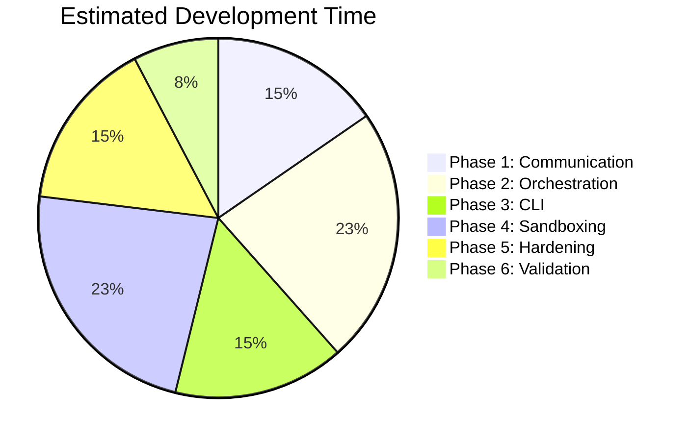
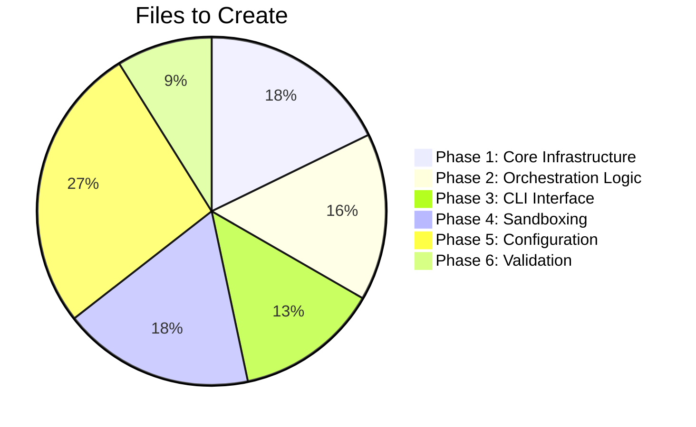

# Implementation Strategy
**Project:** claudesclaude - Multi-Session Orchestration Plugin
**Strategy Date:** 2026-01-13
**Planned Duration:** 2-3 development sessions

---

## 📋 ROADMAP MAPPING TO IMPLEMENTATION

### High-Level Strategy
**Core Transformation:** Canvas drawing application → Multi-agent orchestration system
**Preservation Strategy:** Maintain Claude Code plugin integration while replacing core functionality
**Migration Approach:** Phase-by-phase replacement with feature parity testing

---

## 🎯 PHASE 1: COMMUNICATION INFRASTRUCTURE (2 hours)

### Roadmap Item Alignment
- **From roadmap.md:** "Smart Isolation" and "Structured Communication"
- **From development_phases.md:** Core messaging and session management

### File Creation Strategy
```typescript
// NEW FILES (create from scratch)
src/core/
├── message-bus.ts              // File-based communication system
├── registry.ts                 // Session tracking and management
├── types.ts                    // TypeScript interfaces for all messages
├── security.ts                 // Input validation and sanitization
└── utils/
    └── git.ts                 // Git branching utilities

// TEST FILES
tests/
├── unit/
│   ├── message-bus.test.ts    // 100% coverage required
│   ├── registry.test.ts       // 100% coverage required
│   └── security.test.ts      // Security validation tests
└── integration/
    ├── message-registry.test.ts // Cross-component integration
    └── git-flow.test.ts        // Git integration workflow
```

### Implementation Dependencies
```json
{
  "runtime": [],
  "devDependencies": [
    "@types/jest": "^29.0.0",
    "jest": "^29.0.0",
    "@types/uuid": "^9.0.0",
    "uuid": "^9.0.0"
  ]
}
```

### Definition of Done
- [ ] Message bus handles 100 concurrent messages without data loss
- [ ] Registry tracks dynamic session registration/deregistration
- [ ] All TypeScript interfaces are strictly typed
- [ ] Git utilities create branches with proper isolation
- [ ] Unit tests achieve 100% coverage
- [ ] Integration tests verify end-to-end message flow
- [ ] Code passes linting (once configured)

### Critical Path Dependencies
- Message bus → Registry (registry depends on message types)
- Git utilities → All orchestration phases
- Security → All components (early implementation prevents rework)

---

## 🎯 PHASE 2: ORCHESTRATION LOGIC (3 hours)

### Roadmap Item Alignment
- **From roadmap.md:** "CEO Session" and "Department Sessions" orchestration
- **From development_phases.md:** Director commands and department lifecycle

### File Creation Strategy
```typescript
// NEW FILES
src/core/
├── director.ts                // CEO orchestration logic
├── department.ts               // Department worker implementation
├── checkpoint.ts               // Checkpoint management
└── context.ts                  // Context compaction/verification

// CONFIGURATION
src/
└── config/
    ├── departments.ts         // Department definitions
    └── orchestration.ts       // Orchestration rules

// TEST FILES
tests/
├── integration/
│   ├── orchestration.test.ts  // Full workflow test
│   ├── checkpoint.test.ts     // Checkpoint lifecycle tests
│   └── context-verify.test.ts // Context verification tests
└── fixtures/
    ├── mock-departments.ts    // Test department fixtures
    └── sample-projects.ts     // Sample project configurations
```

### Implementation Dependencies
```json
{
  "runtime": [
    "simple-git": "^3.19.0",
    "winston": "^3.10.0"
  ],
  "devDependencies": []
}
```

### Definition of Done
- [ ] Director can spawn and manage departments
- [ ] Departments operate in isolated environments
- [ ] Checkpoints capture complete state
- [ ] Context verification detects omissions
- [ ] Integration tests pass with mock feature requiring 3 departments
- [ ] Winston logging is implemented and structured
- [ ] Git integration creates proper branch isolation

### Critical Path Dependencies
- Director → Department creation (dependency on registry)
- Checkpoint → Message bus (for state persistence)
- Context verification → Security (for input validation)

---

## 🎯 PHASE 3: CLI COMMAND INTERFACE (2 hours)

### Roadmap Item Alignment
- **From roadmap.md:** User-facing "checkpoint and merge workflow"
- **From development_phases.md:** Command parsing and UI rendering

### File Creation Strategy
```typescript
// NEW FILES
src/cli/
├── commands.ts                // Command definitions and handlers
├── parser.ts                  // Command line argument parsing
└── ui.ts                      // Status dashboard with Ink

// CLI ENTRY POINTS
bin/
├── claude-multi-session       // Main CLI executable
└── department-spawn           // Department spawn utility

// TEST FILES
tests/
├── e2e/
│   ├── cli.test.ts           // Puppeteer CLI interaction tests
│   └── command-flow.test.ts  // Command sequence validation
└── fixtures/
    ├── sample-configs.ts     // CLI configuration samples
    └── command-examples.ts   // Command usage examples
```

### Implementation Dependencies
```json
{
  "runtime": [
    "ink": "^3.2.0",
    "commander": "^11.0.0",
    "express": "^4.18.0"
  ],
  "devDependencies": [
    "@types/express": "^4.17.0",
    "puppeteer": "^21.0.0"
  ]
}
```

### Definition of Done
- [ ] `claude-multi-session init` creates configuration
- [ ] `claude-multi-session create-department` spawns departments
- [ ] `claude-multi-session status` shows real-time dashboard
- [ ] `claude-multi-session checkpoint` creates feature checkpoints
- [ ] `claude-multi-session merge` integrates department work
- [ ] E2E tests verify complete command workflows
- [ ] Error handling provides user-friendly messages

### Critical Path Dependencies
- Commands → Director (for orchestration execution)
- UI → Message bus (for real-time status updates)
- Parser → Configuration (for command validation)

---

## 🎯 PHASE 4: SANDBOXING & ISOLATION (3 hours)

### Roadmap Item Alignment
- **From roadmap.md:** "Smart Isolation" with separate environments
- **From development_phases.md:** True session isolation using Docker

### File Creation Strategy
```typescript
// NEW FILES
src/core/
├── sandbox.ts                 // Sandbox management
├── isolation.ts               // Isolation verification
└── container.ts               // Container orchestration

// DOCKER CONFIG
docker/
├── department.Dockerfile      // Department container image
├── director.Dockerfile       // Director container image
└── docker-compose.yml        // Container orchestration

// FALLBACK IMPLEMENTATION
scripts/
├── spawn-department.js       // Process spawner (Node.js fallback)
└── isolate-environment.js    // Environment isolation

// TEST FILES
tests/
├── security/
│   ├── isolation.test.ts     // Prove sessions can't interfere
│   ├── container.test.ts     // Container security tests
│   └── env-isolation.test.ts // Environment variable isolation
└── performance/
    ├── container-overhead.ts  // Container performance benchmark
    └── spawn-latency.ts      // Process spawn timing
```

### Implementation Dependencies
```json
{
  "runtime": [
    "dockerode": "^3.3.0"
  ],
  "devDependencies": [
    "@types/dockerode": "^3.3.0"
  ]
}
```

### Definition of Done
- [ ] Departments run in isolated Docker containers
- [ ] Process spawner works as fallback
- [ ] Security verification prevents cross-contamination
- [ ] Environment variables are properly isolated
- [ ] File system access is restricted to workspace
- [ ] Penetration tests fail to break isolation

### Critical Path Dependencies
- Sandbox → All department operations
- Container → Department execution environment
- Security → Isolation verification framework

---

## 🎯 PHASE 5: PRODUCTION HARDENING (2 hours)

### Roadmap Item Alignment
- **From roadmap.md:** Production-ready features and documentation
- **From development_phases.md:** Documentation and examples

### File Updates Strategy
```typescript
// UPDATE EXISTING
package.json                    // Add comprehensive scripts
README.md                      // Complete project documentation
tsconfig.json                  // Build and output configuration

// NEW FILES
src/
└── utils/
    ├── logger.ts              // Replace all console.log
    └── metrics.ts             // Performance monitoring

// CONFIGURATION
claude.config.js               // Configuration schema
scripts/
├── install.sh                 // One-line installer
└── build.sh                   // Production build script

// EXAMPLES
examples/
└── demo-project/
    ├── README.md              // Example usage guide
    ├── config/
    │   └── departments.ts     // Example department configuration
    └── src/
        └── feature-demo.ts   // Multi-agent feature implementation

// DOCUMENTATION UPDATES
docs/
├── API.md                     // API reference
├── DEPLOYMENT.md             # Deployment guide
└── TROUBLESHOOTING.md        # Common issues and solutions
```

### Implementation Dependencies
```json
{
  "runtime": [],
  "devDependencies": [
    "prettier": "^3.0.0",
    "eslint": "^8.0.0",
    "@typescript-eslint/eslint-plugin": "^6.0.0",
    "@typescript-eslint/parser": "^6.0.0"
  ]
}
```

### Definition of Done
- [ ] No `TODO` or `FIXME` comments in codebase
- [ ] All error messages user-friendly
- [ ] All public APIs documented with JSDoc
- [ ] Example project demonstrates full workflow
- [ ] One-line installer works correctly
- [ ] Performance benchmarks established
- [ ] Documentation is comprehensive and accurate

---

## 🎯 PHASE 6: DIRECTOR VALIDATION (1 hour)

### Roadmap Item Alignment
- **From roadmap.md:** Final production readiness
- **From development_phases.md:** Director sign-off process

### Deliverables
```typescript
// VALIDATION artifacts
docs/
├── qa_report.md              # QA checklist results
├── performance-benchmark.md  # Performance metrics
└── retrospective.md          # Development retrospective

// RELEASE PREPARATION
.gitignore                    # Update with build artifacts
package.json                 # Version bump and scripts
CHANGELOG.md                 # Release notes
```

### Validation Checklist
- [ ] Clean environment test (qa_checklist.md)
- [ ] Manual exploratory testing completed
- [ ] Security review passed
- [ ] Performance benchmarks met
- [ ] Documentation verified
- [ ] Example project end-to-end working
- [ ] All automated tests passing

### Critical Success Factors
- Production-ready deployment process
- Comprehensive documentation
- Performance and reliability metrics
- Security validation complete
- User experience validated

---

## 📊 ESTIMATED EFFORT DISTRIBUTION

### Time Investment by Phase


### File Creation by Phase


### Risk Assessment by Phase
| Phase | Risk Level | Mitigation Strategy |
|-------|------------|---------------------|
| 1 | Medium | Early message bus testing |
| 2 | High | Incremental department implementation |
| 3 | Low | Commander and Ink are mature |
| 4 | High | Container security testing critical |
| 5 | Low | Documentation and polishing |
| 6 | Medium | Thorough validation required |

---

## 🚀 SUCCESS METRICS

### Technical Metrics
- **Code Coverage:** 95%+ on core components, 80%+ overall
- **Performance:** <100ms message bus latency, <1s department spawn
- **Reliability:** 0 data loss under concurrent operations
- **Security:** Pass all isolation penetration tests

### User Experience Metrics
- **CLI Learning Curve:** <5 minutes to basic usage
- **Documentation Completeness:** 100% of features documented
- **Example Project:** Working end-to-end in <10 minutes
- **Error Handling:** User-friendly messages for all failure modes

### Development Quality Metrics
- **Code Quality:** ESLint clean, Prettier formatted
- **Type Safety:** 100% TypeScript with strict null checks
- **Test Reliability:** 100% test pass rate, flake-free
- **Documentation Accuracy:** Code samples match actual behavior

---

## 🔄 ITERATION STRATEGY

### Quality Gates
1. **Before Phase N+1:** All deliverables in Phase N must be complete
2. **Code Review:** Self-review against developer_guide.md standards
3. **Test Coverage:** Meet minimum coverage requirements
4. **Integration:** Must work with previous phases
5. **Documentation:** All changes documented

### Continuous Integration
```bash
# Pre-commit checks
npm run lint          # Code quality
npm run type-check    # TypeScript validation
npm run test          # Unit tests
npm run build         # Build verification

# Post-merge checks
npm run security-scan # Vulnerability scanning
npm run performance-test # Performance benchmarks
npm run e2e-test     # End-to-end workflow
```

### Escalation Protocol
If blocked:
1. Document blocker in detail
2. List attempted solutions
3. Recommend alternatives
4. Await Director decision
5. Never proceed past ambiguity

---

## 🎯 FIRST ACTION PRIORITIES

### Immediate Next Steps (Starting Phase 1)
1. **Setup development environment**
   - Install missing dependencies
   - Configure TypeScript and testing
   - Set up linting and formatting

2. **Create message bus foundation**
   - TypeScript interfaces for messages
   - File-based communication system
   - Basic registry implementation

3. **Implement initial git utilities**
   - Branch creation utilities
   - Commit with metadata
   - Isolation verification

### Most Critical Dependencies
1. **Message types** (foundation of all communication)
2. **Session registry** (enables department tracking)
3. **Git integration** (critical for isolation)
4. **Security validation** (prevents rework)

---

**STRATEGY COMPLETE**
Implementation plan aligned with development_phases.md and roadmap.md. Ready to begin autonomous execution with clear quality gates and success metrics.